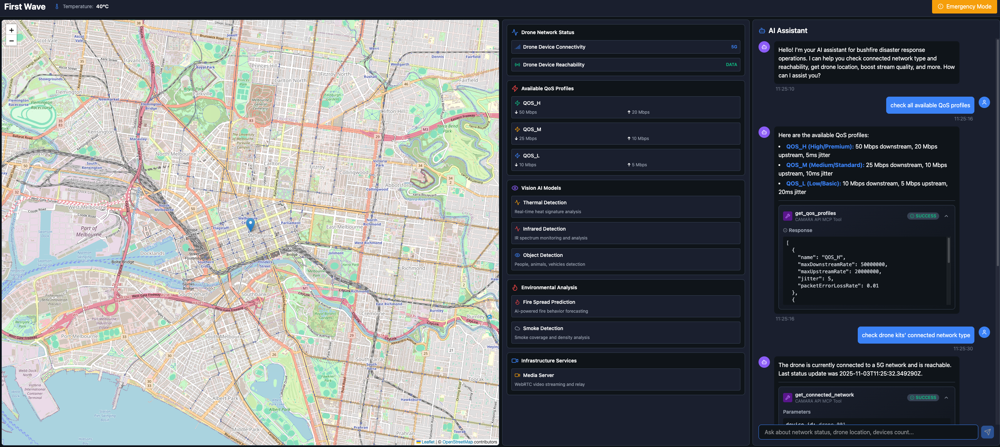
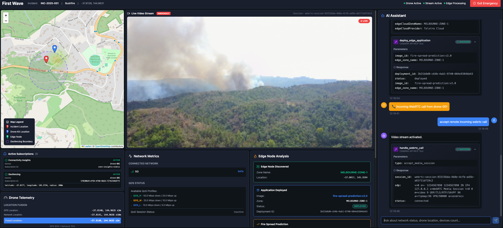

# Disaster Response Drone System

A comprehensive bushfire response system using drones and CAMARA network APIs for real-time disaster monitoring and response coordination.

Developed for [Telstra's Connected Future Hackathon 2025](https://telstra.brightidea.com/CFH2025). See [Rubrics](./Rubrics.md) for elevator pitch and details about how this project addresses the hackathon criteria.

## 🌟 Executive Summary

This system demonstrates an innovative disaster response solution combining drone operations with 15 CAMARA network APIs. The typical workflow involves:

1. **Incident Reporting**: Operator reports bushfire location (street address) in chatbot interface
2. **Geofencing Setup**: Creates geofencing subscription around disaster area with visual map marker
3. **Location Verification**: Confirms drone arrival at scene via location verification API
4. **Edge Computing**: Discovers closest edge node and deploys AI model
5. **Live Streaming**: Drone streams video via WebRTC call
6. **QoS Management**: Dynamically adjusts network quality (QoS profiles) based on network conditions
7. **Real-time Monitoring**: Tracks drone location, network connectivity, and region device count with heatmap visualization
8. **AI Assistance**: Natural language queries for system status and mission management

## 📸 Dashboard Screenshots

### Normal Mode


_Dashboard in normal mode showing general drone operations and system status_

### Incident Mode


_Dashboard in incident mode displaying active disaster response with real-time video, telemetry, network metrics, and AI assistance_

## 🏗️ System Architecture

```
┌──────────────────────────────────────────────────────────────┐
│                 React Dashboard (Port 5173)                  │
│  ┌──────────────┐  ┌──────────────┐  ┌──────────────────┐    │
│  │  Map View    │  │ Video Stream │  │  Network Metrics │    │
│  │   - Heatmap  │  │  - WebRTC    │  │  - QoS Status    │    │
│  │   - Markers  │  │              │  │  - connectivity  │    │
│  └──────────────┘  └──────────────┘  └──────────────────┘    │
│  ┌────────────────────────────────────────────────────────┐  │
│  │        AI Assistant Chatbot (MCP Tool Calling)         │  │
│  │        Real-time Event Stream (SSE Connection)         │  │
│  └────────────────────────────────────────────────────────┘  │
└──────────────────────────────────────────────────────────────┘
                              │
                              │
                              │
            ┌─────────────────▼───────────────────┐
            │       Backend API (Port 4000)       │
            │     ┌───────────▼───────────────┐   │
            │     │  - events notification    │   │
            │     │  - AI Agent               │   │
            │     │  - MCP Client             │   │
            │     └──────────┬────────────────┘   │
            │                │                    │
            │     ┌──────────▼────────────────┐   │
            │     │  CAMARA MCP Server (stdio)│   │
            │     └──────────┬────────────────┘   │
            └────────────────│────────────────────┘
                             │
            ┌────────────────│────────────────────┐
            │     ┌──────────▼──────────────┐     │
            │     │  Open AI compatible LLM │     │
            │     │ (gemini-2.0-flash-lite) │     │
            │     └─────────────────────────┘     │
            └─────────────────────────────────────┘
```

## 🚀 Quick Start

### Prerequisites

- **Node.js** 18+ (for dashboard)
- **Python** 3.12+ (for backend)
- **Google Gemini API Key** (set as environment variable)

### 1. Start Backend API

```bash
cd backend-api
source .venv/bin/activate  # or activate your virtual environment
uvicorn app.main:app --reload --port 4000
```

Backend runs at `http://localhost:4000`

### 2. Start Dashboard

```bash
cd frontend-dashboard
npm install
npm run dev
```

Dashboard runs at `http://localhost:5173`

## 🧩 Core Components

### 1. Frontend Dashboard (React + TypeScript)

**Purpose**: Operator interface for disaster response coordination

**Key Features**:

- **Dual Mode Operation**: Normal mode (general ops) and Incident mode (active response)
- **Interactive Map**: drone, bushfire, edge node location markers device count heatmap, geofencing circles
- **AI Chatbot**: Natural language interface for CAMARA API operations
- **Live Video Stream**: WebRTC video call streaming session
- **Real-time Telemetry**: Altitude, speed, heading, battery, signal strength
- **Network Insights**: 4G/5G status, QoS profiles, connectivity metrics with charts
- **Event Stream**: SSE-based real-time updates for location and device counts

### 2. Backend with AI Agent (FastAPI Server)

**Purpose**: Orchestrate CAMARA API calls via MCP and provide AI assistance

**Components**:

- **FastAPI Server**: backend API, SSE and events endpoints
- **AI Agent**: LLM-powered chatbot with tool calling capabilities
- **MCP Client**: Communicates with CAMARA MCP server via stdio
- **Event Streaming**: Periodic location updates (10s) and device count updates (30s)

### 3. CAMARA MCP Server (FastMCP)

**Purpose**: Provide mocked CAMARA API implementations as MCP tools for the AI agent

**Implementation Approach**:

- Built with **FastMCP** (Model Context Protocol server framework)
- Runs as subprocess with stdio communication
- Returns mock data that simulates CAMARA API responses
- 14 MCP tools

**Note**: All CAMARA APIs are mocked - no actual network API calls are made. This demonstrates the chatbot UX and integration patterns for the hackathon.

## 💬 Typical User Interaction Flow (Prompts)

This section describes the typical flow from the operator's perspective when using the system:

### Normal Mode Operations

**1. Pre-Flight Integrity Check**

```
Operator: "Conduct preflight integrity check"
AI Response: Verifies phone number, checks for SIM/device swaps
Dashboard: Shows integrity status in StatusPanel (Number Verified, SIM Status, Device Status)
```

**2. Query Available QoS Profiles**

```
Operator: "Check all available QoS profiles"
AI Response: Lists QOS_H, QOS_M, QOS_L with bandwidth and latency specs
```

**3. Check Drone Network Status**

```
Operator: "Check drone kit's connected network type"
AI Response: Returns network type (5G), reachability status (DATA)
```

**4. Create Network Type Subscription**

```
Operator: "Create a subscription on device network type change"
AI Response: Creates subscription, returns subscription ID
```

### Incident Mode Workflow

**Phase 1: Incident Reporting & Geofencing**

**5. Report Bushfire Location**

```
Operator: "A bushfire is reported at 1234 Mount Dandenong Tourist Rd, Kalorama VIC 3766"
AI Response: Geocodes address → returns lat/lon coordinates (-37.8136, 144.9631)
Dashboard: Adds incident marker on map
```

**6. Create Geofencing Subscription**

```
Operator: "Create geofencing subscription at this location with radius of 200m for our drone kit"
AI Response: Creates geofencing subscription, returns subscription ID
Dashboard: Displays geofencing circle on map
```

**Phase 2: Drone Arrival & Edge Deployment**

**7. Verify Drone Arrival**

```
Operator: "Check if drone kit has arrived at the bushfire scene"
AI Response: Verifies drone location within geofencing area
Dashboard: Displays drone marker on map
```

**8. Deploy Edge AI Model**

```
Operator: "Find closest edge computing node location and then deploy the fire spread prediction image in that node (image id: fire-spread-prediction:v2.0)"
AI Response: Discovers edge node, deploys AI model
Dashboard: Adds edge node marker on map, shows deployment status
```

**Phase 3: Video Streaming & QoS Management**

**9. Accept Incoming WebRTC Call**

```
System: Incoming WebRTC call event from drone
Operator: "Accept remote incoming webrtc call"
AI Response: Creates WebRTC session
Dashboard: Video player shows live stream, AI analysis overlays appear
```

**10. Create Quality on Demand Session**

```
Operator: "Create a new QoD session for this webrtc media call using QoS_M"
AI Response: Creates QoD session with QOS_M profile
Dashboard: QoS badge shows "QOS_M" active status
```

**11. Upgrade QoS Profile**

```
System: Connectivity insights alert - QoS threshold breached
Operator: "Create a new QoD session for this webrtc media call using QoS_H"
AI Response: Upgrades QoD session to QOS_H profile
Dashboard: QoS badge updates to "QOS_H"
```

**Phase 4: Mission Monitoring**

During the mission, the backend automatically:

- Updates drone location every 10 seconds (displayed on map with trail)
- Updates region device count every 30 seconds (heatmap visualisation)
- Streams connectivity insights and network status to dashboard
- Displays all active subscription events

**Phase 5: Mission Cleanup**

**12. Terminate WebRTC Session**

```
Operator: "Cancel this webrtc call session"
AI Response: Terminates WebRTC session
Dashboard: Video stream stops
```

**13. Undeploy Edge AI Model**

```
Operator: "Undeploy fire-spread-prediction:v2.0 model from edge node"
AI Response: Undeploys model from edge node
Dashboard: Edge node status updates
```

**14. Cancel Subscriptions**

```
Operator: "Cancel the geofencing subscription (b2a18994-5fde-442c-b785-db2d7c9f4fec)"
Operator: "Cancel the network type subscription created earlier for drone kit"
AI Response: Deletes subscriptions
Dashboard: Removes geofencing circle, stops event notifications
```

**15. Close Incident**

```
Operator: Manually switches dashboard back to normal mode
Dashboard: Returns to normal status, clears incident markers
```

## 🔄 Incident Mode Sequence Diagram

The following diagram illustrates the complete incident mode flow from incident reporting through mission completion:

```mermaid
sequenceDiagram
    participant User as Operator
    participant FE as Frontend Dashboard
    participant BE as Backend API<br/>(AI Agent + MCP Client)
    participant MCP as MCP Server
    participant Edge as Edge Node
    participant Drone as Drone Kit

    Note over User,Drone: Phase 0: Incident Initiation
    User->>FE: Report incident via chatbot<br/>"Bushfire at [address]"
    FE->>BE: POST /api/chat/message
    BE->>BE: AI Agent processes user message
    BE->>MCP: geocode_address(address)
    MCP-->>BE: {lat, lon}
    BE-->>FE: SSE stream (incident location)
    FE->>FE: Add incident marker to map<br/>Switch to Emergency Mode
    Note over User,Drone: Rescue teams & drone deployed

    Note over User,Drone: Phase 1: Edge Setup & Deployment
    User->>FE: "Find closest edge node and deploy<br/>fire-spread-prediction:v2.0"
    FE->>BE: POST /api/chat/message
    BE->>BE: AI Agent processes request
    BE->>MCP: discover_edge_node(lat, lon)
    MCP-->>BE: {edgeZone, location}
    BE->>MCP: deploy_edge_application(zone, imageId)
    MCP-->>BE: {deploymentId, status}
    MCP->>Edge: Deploy media server + AI model
    Edge-->>MCP: Deployment successful
    BE-->>FE: SSE stream (edge info)
    FE->>FE: Show edge marker on map<br/>Update EdgeAnalysisResults

    Note over User,Drone: Phase 2: Geofencing & Flight
    User->>FE: "Create geofencing subscription<br/>radius 200m for drone"
    FE->>BE: POST /api/chat/message
    BE->>BE: AI Agent processes request
    BE->>MCP: subscribe_geofencing(deviceId, lat, lon, radius)
    MCP-->>BE: {subscriptionId}
    BE-->>FE: SSE stream (geofencing data)
    FE->>FE: Draw geofencing circle on map<br/>Add to ActiveSubscriptionsPanel

    User->>FE: "Accept remote incoming WebRTC call"
    FE->>BE: POST /api/chat/message
    BE->>BE: AI Agent processes request
    BE->>MCP: handle_webrtc_call(action: create)
    MCP-->>BE: {sessionId}
    Drone->>Edge: Start WebRTC video stream
    Edge-->>Drone: Stream acknowledged
    Edge-->>MCP: Relay media streaming
    BE-->>FE: SSE stream (video session)
    FE->>FE: Show video in VideoStreamViewer

    Note over User,Drone: Phase 3: Continuous Monitoring
    loop Every 10 seconds
        BE->>MCP: Location Retrieval API
        MCP->>Drone: Get GPS location
        Drone-->>MCP: {gps, network locations}
        MCP-->>BE: {fused location}
        BE-->>FE: SSE: location_update
        FE->>FE: Update drone marker on map<br/>Update TelemetryPanel
    end

    loop Every 30 seconds
        BE->>MCP: Region Device Count API
        MCP-->>BE: {deviceCount, heatmapData}
        BE-->>FE: SSE: region_device_count
        FE->>FE: Update heatmap overlay
    end

    User->>FE: "Subscribe to network type changes"
    FE->>BE: POST /api/chat/message
    BE->>BE: AI Agent processes request
    BE->>MCP: subscribe_connected_network(deviceId)
    MCP-->>BE: {subscriptionId}
    BE-->>FE: SSE stream (subscription info)
    FE->>FE: Add to ActiveSubscriptionsPanel

    Note over BE,Drone: Network event triggers
    Drone->>MCP: Network type changed (4G → 5G)
    MCP->>BE: Subscription notification
    BE-->>FE: SSE: connected_network_type
    FE->>FE: Show notification<br/>Update NetworkMetricsPanel

    Note over User,Drone: Phase 4: QoS Management
    User->>FE: "Create QoD session using QOS_M"
    FE->>BE: POST /api/chat/message
    BE->>BE: AI Agent processes request
    BE->>MCP: get_qos_profiles()
    MCP-->>BE: {QOS_H, QOS_M, QOS_L}
    BE->>MCP: create_quality_on_demand(qosProfile: QOS_M)
    MCP-->>BE: {qodSessionId}
    BE-->>FE: SSE stream (QoS info)
    FE->>FE: Update NetworkMetricsPanel<br/>Show QOS_M badge

    loop Every 10 seconds
        BE->>MCP: Connectivity Insights API
        MCP-->>BE: {latency, jitter, packetLoss, throughput}
        BE-->>FE: SSE: connectivity_insights
        FE->>FE: Update NetworkMetricsPanel KPIs
    end

    Note over User,Drone: Phase 5: AI Queries
    User->>FE: "What is the current location<br/>of the drone?"
    FE->>BE: POST /api/chat/message
    BE->>BE: AI Agent processes query
    BE->>MCP: Location Retrieval API
    MCP->>Drone: Get location
    Drone-->>MCP: {lat, lon, accuracy}
    MCP-->>BE: Location data
    BE-->>FE: SSE stream (AI response:<br/>"Drone is at [coordinates]")
    FE->>FE: Display in chatbot

    User->>FE: "How many people are in<br/>the disaster area?"
    FE->>BE: POST /api/chat/message
    BE->>BE: AI Agent processes query
    BE->>MCP: Region Device Count API
    MCP-->>BE: {deviceCount: 75}
    BE-->>FE: SSE stream (AI response:<br/>"~75 devices detected")
    FE->>FE: Display in chatbot

    Note over User,Drone: Phase 6: Mission Completion
    User->>FE: "Mission complete, cleanup<br/>and close incident"
    FE->>BE: POST /api/chat/message
    BE->>BE: AI Agent processes cleanup request

    BE->>MCP: handle_webrtc_call(action: cancel)
    MCP->>Edge: Terminate WebRTC session
    Edge-->>MCP: Session terminated
    MCP-->>BE: WebRTC call ended

    BE->>MCP: undeploy_edge_application(deploymentId)
    MCP->>Edge: Undeploy apps
    Edge-->>MCP: Undeployed
    MCP-->>BE: Edge cleanup complete

    BE->>MCP: unsubscribe_geofencing(subscriptionId)
    MCP-->>BE: Subscription cancelled

    BE->>MCP: unsubscribe_connected_network(subscriptionId)
    MCP-->>BE: Subscription cancelled

    BE-->>FE: SSE stream (cleanup status)
    FE->>FE: Clear map markers<br/>Switch to Normal Mode<br/>Show StatusPanel

    BE-->>FE: SSE stream (final message:<br/>"Mission completed")
    FE->>FE: Display completion message
```



## Future Enhancements

- Multi-drone coordination using CAMARA Network Slice Booking API
- Display drone simulator in dashboard for end-to-end demo
- Continuous security monitoring with SIM/Device Swap subscriptions during flight
