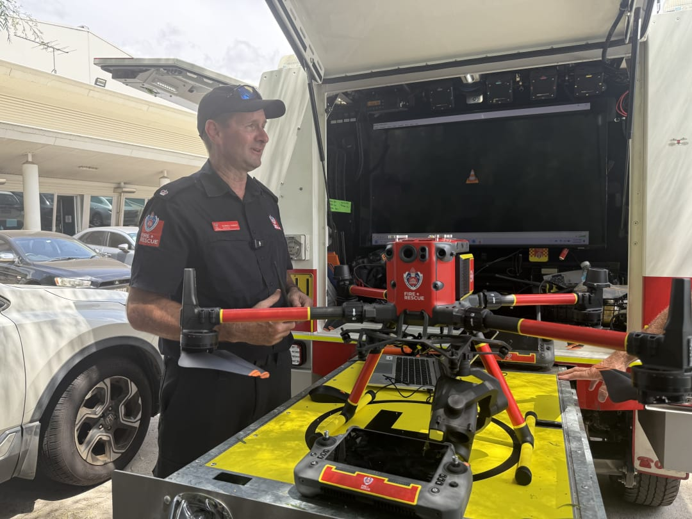
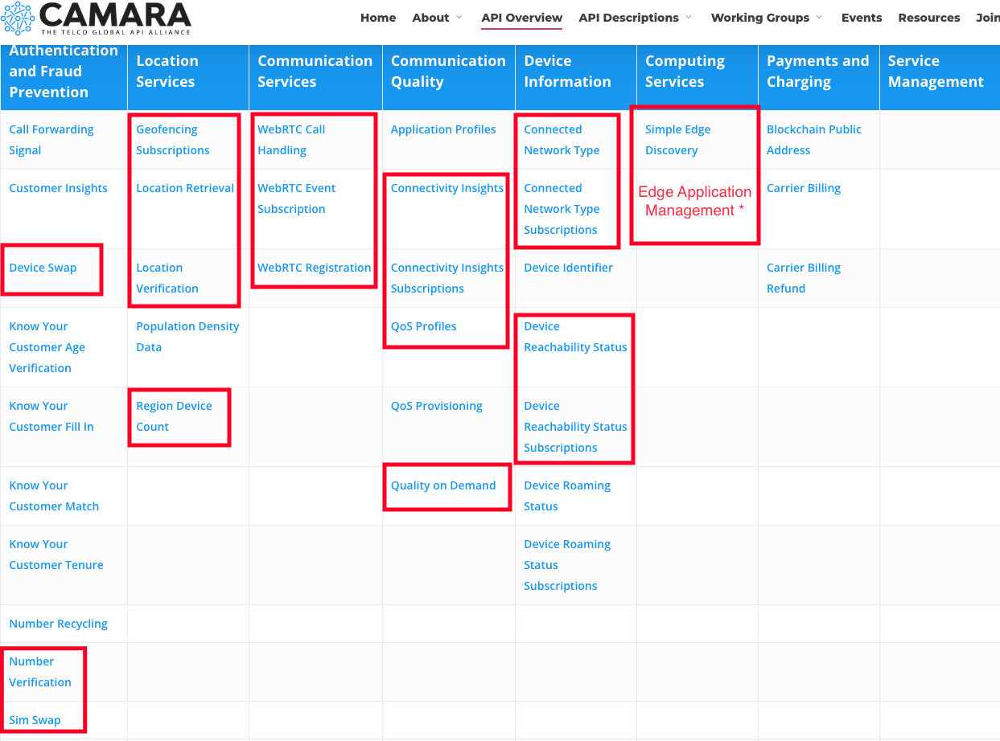
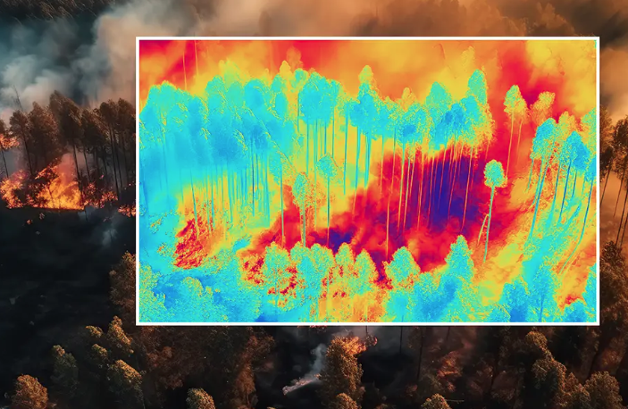
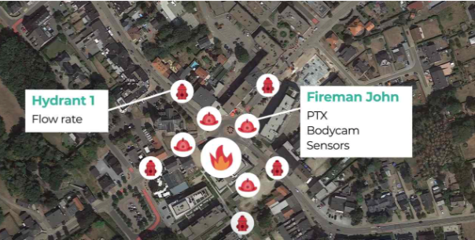
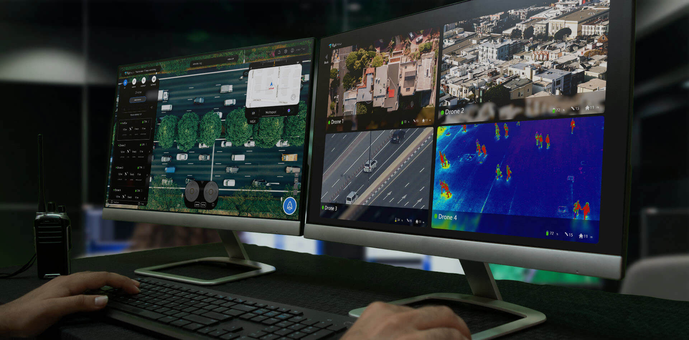

# AI-Powered Network-Aware Disaster Response Platform

## Firefighting drones in active services

- Situational awareness
- Search and rescue
- Real-time video streaming
- Thermal assessment

## CAMARA APIs revolutionise firefighting operations

## Empowering Emergency Services with AI chatbot

## Demo Showcase

- **Centralised Control Dashboard**
- **AI Chatbot Interface**
- **MCP server Integration**
- **Interactive Map**
- **Event Subscription**
- **Live Video Streaming**
- **Edge AI Processing**
- **Network Metrics/Telemetry Panel**

### MCP Integration Flow

1. **User Command**: "Create geofencing subscription" via AI chatbot
2. **Backend API Processing**: FastAPI routes to MCP server
3. **CAMARA API Call**: MCP tool calls Geofencing Subscriptions API
4. **Real-time Updates**: Create geofencing boundary on the map

## Potential Future Enhancement

**_Thermal Image Overlay_**

**_Mixed reality integration_**

**_Multi Drone/Cam collaboration_**

